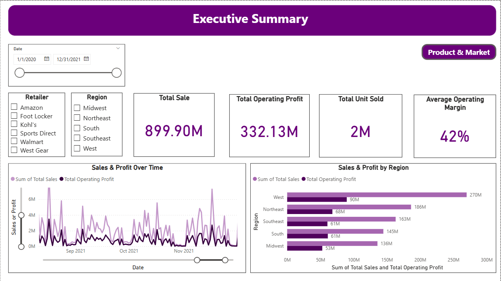
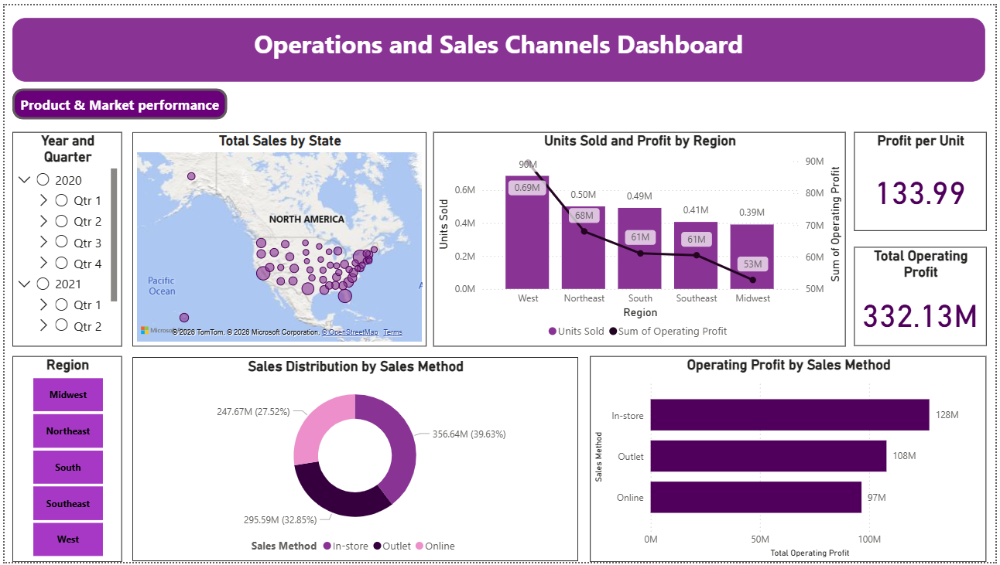
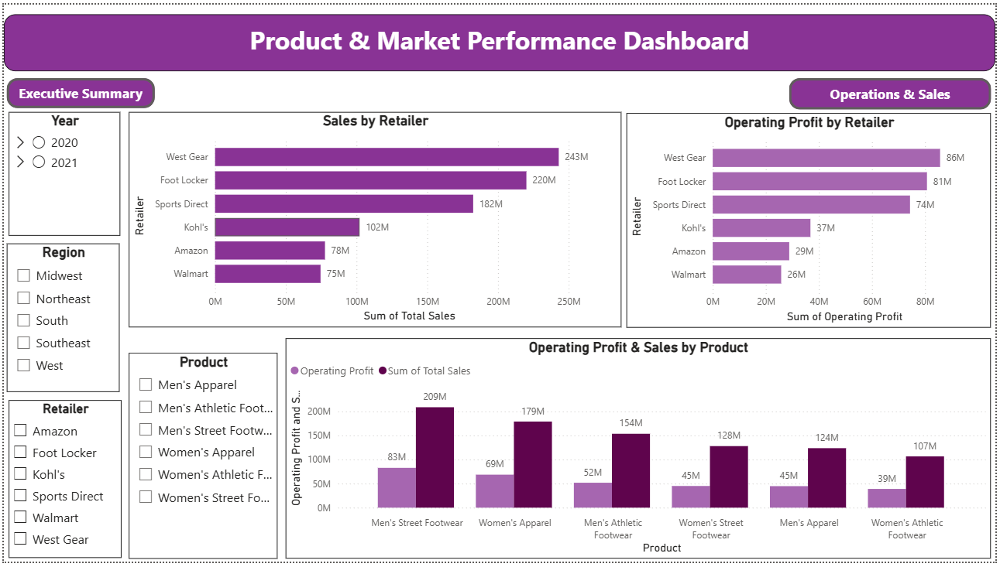

# Adidas Sales Performance Dashboard

## Overview
This project presents an interactive Power BI dashboard developed using the Adidas US Sales Dataset. The dashboard analyzes sales performance, profitability, units sold, operating margin, product trends, regional performance, and sales methods.

## Dataset
- Dataset: Adidas US Sales Dataset
- Source: Kaggle
- Records: 9,648 sales records

## Objectives
- Analyze total sales, operating profit, units sold, and operating margin.
- Identify product, retailer, and regional sales performance.
- Build a CEO-level overview dashboard for management decision-making.
- Present sales insights using interactive Power BI visuals.

## Key Metrics
- Total Sales: Approximately $899.9M
- Operating Profit: Approximately $332.13M
- Units Sold: Approximately 2.48M
- Operating Margin: Approximately 42%

## Dashboard Features
## Dashboard Screenshots

### CEO Overview Page

### Operation and Sales Page

### Product and Market Performance Page

- CEO overview page
- KPI cards
- Sales and profit analysis
- Product performance analysis
- Regional performance analysis
- Sales method analysis
- Interactive slicers and visuals

## Tools Used
- Power BI
- Microsoft Excel
- Data Cleaning
- Data Visualization
- Business Intelligence
- KPI Reporting

## Key Learning
Converted raw sales data into clear business insights for management-level decision-making.
